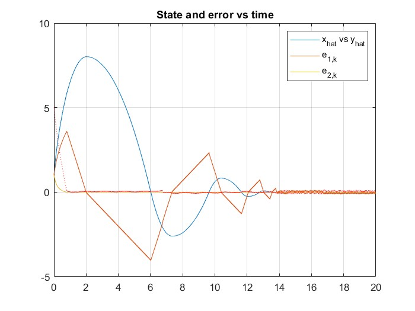

# Technical Analysis and Simulation of Chattering-Free Digital Sliding-Mode Control

## Project Overview
- This project involves the MATLAB simulation of the concepts presented in the paper "Chattering-Free Digital Sliding-Mode Control With State Observer and Disturbance Rejection". Our work simulates the results originally obtained using SICONOS and verifies these results using MATLAB. This project was undertaken for ENPM667. 

## Authors
- Datta Lohith Gannavarapu - UID: 119455395
- Venkata Sai Sricharan Kasturi - UID: 119444788

## File Structure
The MATLAB codes are organized according to the systems they simulate. Each system script contains the necessary functions to run the simulations. The systems are categorized as follows:

- [System1.m](Project/System1.m)
- [System2.m](Project/System2.m)
- [System3.m](Project/System3.m)

## Running the Simulations
To run the simulations for each system:

1. Navigate to the extracted folder.
2. Run the main MATLAB script provided for that system and make sure to have the folder added to path.
3. The script will execute the simulation and generate the corresponding graphs.
4. To run different test cases, uncomment the lines mentioned in the .m files

## Dependencies
MATLAB R2023a

## Assumptions
To avoid a circle of projections as suggested in the paper, previoud value is used in System2 and 3.

## Results
The detailed technical report for this project can be found at [Technical Report](gdatta_charan03_technical_report.pdf). This report includes comprehensive explanations of the methodologies, simulation results, and discussions on the findings. The Output Results for the three Systems are illustrated below.

### System 1

### System 2

### System 3

## References
Original Paper: Vincent Acary, Bernard Brogliato, and Yury V. Orlov, "Chattering-Free Digital Sliding-Mode Control With State Observer and Disturbance Rejection", IEEE Transactions on Automatic Control, Vol. 57, No. 5, May 2012. [PDF](Chattering-Free_Digital_Sliding-Mode_Control_With_State_Observer_and_Disturbance_Rejection.pdf)
